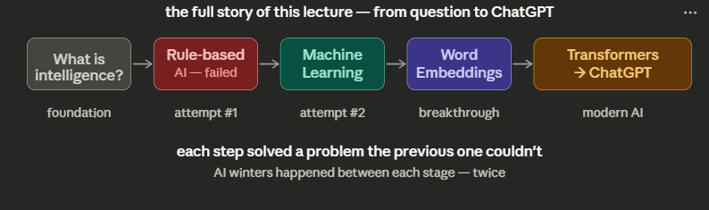

# 01. Fast-Tracking the Course of AI

## 1. What Does It Mean to Learn?

**Key points:**

- Learning = changing yourself based on experience
- Not just storing facts — it's about **adjusting behaviour**
- The loop is: Try → See what happens (feedback) → Adjust → Repeat

> Think of a child learning to walk. They fall, feel the feedback, adjust balance, and try again. That cycle is learning.
> 

**What is Knowledge?**

- **Explicit knowledge** — things you can write down: "Paris is the capital of France"
- **Implicit knowledge** — things you just know how to do but can't explain: riding a bike, recognising a face

**What is Intelligence?**

- Intelligence = the ability to **achieve goals in a wide range of situations**
- It's not just memorising — it's adapting to new, unseen situations

## 2. What is AI?

**Key points:**

- AI = making machines do things that would require intelligence if a human did them
- Examples: recognising faces, understanding language, playing chess, driving a car
- AI is the **goal**, not a specific technology

## 3. Attempt #1: Rule-Based AI (Expert Systems)

**Key points:**

- Humans manually write IF-THEN rules for every situation
- Works for simple, well-defined problems (spam filters, chess piece moves)
- Also called "Expert Systems" — popular in the 1980s

**Why it failed — 3 examples the slide uses:**

- **Recognising a face** — how do you write a rule for every angle, lighting, and expression of every person?
- **Understanding sarcasm** — "Oh great." Is it genuine or sarcastic? Rules can't capture tone
- **Decoding idioms** — "It's raining cats and dogs" — a rule-based system might literally look for falling animals

> The key insight: humans do these things **intuitively** — we can't even explain the rules ourselves, so we definitely can't write them down for a machine.
> 

## 4. AI vs ML vs Deep Learning

**Key points:**

- These three are often confused — they are actually nested layers, not synonyms
- **AI** = the big goal (smart machines)
- **ML** = one method to achieve AI (learning from data)
- **Deep Learning** = one powerful type of ML (using many-layered neural networks)

| Term | What it is | Example |
| --- | --- | --- |
| AI | The goal | A machine that can drive a car |
| ML | A method | Teaching a machine using car-driving data |
| Deep Learning | A technique within ML | The specific neural net architecture used |

> Deep Learning is inside ML, which is inside AI. ML is not AI — it's one path to it.
> 

## 5. Early ML: Modest Successes — and Why It Was Limited

**What worked in early ML:**

- Spam filters became smarter
- Recommendation systems (Netflix, Amazon — "you might also like")
- Basic image recognition

**What still failed:**

- Couldn't have a conversation
- Couldn't understand a full paragraph
- Couldn't recognise objects as well as a toddler

**The two bottlenecks:**

- **Not enough data** — ML needs millions of labelled examples; the internet barely existed
- **Not enough compute** — computers were too slow; training on large datasets would take years

**The AI Winters (happened twice):**

- **1970s** — researchers promised human-level AI in 20 years → failed to deliver → funding cut
- **1980s–90s** — expert systems were supposed to revolutionise business → too brittle → crashed again

> Saying you worked on "AI" in the 1990s was considered career suicide.
> 

**Why AI finally exploded after 2012 — 3 ingredients came together:**

- **Internet** — suddenly billions of labelled images, sentences, books, and videos existed
- **GPUs** — graphics cards built for gaming turned out to be perfect for the parallel math ML needs
- **Deep Learning** — researchers cracked how to train much deeper and more complex neural networks

## 6. Why Language is Hard for Computers

**Key points:**

- Computers need precision — language is messy, ambiguous, context-dependent
- A single sentence can have multiple valid interpretations
- Rules alone cannot capture this

**The slide's famous example:**

> "I saw the man with the telescope."
— Who had the telescope? Me, or the man?
> 

**Another great example from the slide:**

> "Fast-tracking the AI course" vs "Fast-tracking the course of AI"
— The same words in slightly different order produce completely different meanings
> 

## 7. The Four NLP Attempts

### Attempt #1 — Dictionary Approach

- Give each word a fixed definition from a dictionary
- **Problem:** "Apple" — is it the fruit, the tech company, or the record label? A fixed definition can't know. Context changes everything.

### Attempt #2 — Statistical Patterns

- Look at which words appear together frequently
- Example: "If 'New' is followed by 'York' → city"
- Powered **Google Translate for nearly a decade**
- **Problem:** Pattern matching ≠ understanding. The machine predicts the next word by frequency, not because it knows what words mean.

### Attempt #3 — Word Embeddings (The Breakthrough)

- Instead of one number, each word gets a **vector** — a list of hundreds of numbers
- Each number captures a dimension of meaning (royalty, gender, edibility, etc.)
- Similar words end up **near each other in vector space**
- Famous proof: **King − Man + Woman ≈ Queen** (math on meaning works!)
- **Problem:** Each word still has ONE fixed position. "Bank" gets the same vector whether you mean the river or the financial institution. No sentence context.

### Attempt #4 — Sequence Models (RNNs)

- Process words one at a time, maintaining a "memory" of what was read
- Better — now the model sees the full sequence
- **Problem:** RNNs **forget** long-ago words. By the time it reaches "was happy" at the end of a long sentence, it has lost "The cat" from the beginning. This is called **Long-Range Dependency Failure**.

## 8. Word Embeddings — Dimensions of Meaning

**Key points:**

- Each word = a list of numbers (a vector), not one number
- Each number = one "dimension" of meaning (royalty, edibility, gender, etc.)
- These dimensions are **not manually designed** — the model discovers them automatically

| Word | Royalty | Gender (M) | Edibility |
| --- | --- | --- | --- |
| King | 0.98 | 0.95 | 0.01 |
| Queen | 0.97 | 0.05 | 0.02 |
| Apple | 0.02 | 0.00 | 0.94 |
- King and Queen are similar on royalty, different on gender → their vectors are **close but not identical**
- Apple is far from both → lives in a completely different region of vector space

**Word Math (vector arithmetic):**

- `King − Man + Woman ≈ Queen`
- `Paris − France + Italy ≈ Rome`
- `Walking − Walk + Swim ≈ Swimming`

These work because the **direction from Man→Woman** is the same geometric direction as **King→Queen** in vector space.

## 9. The Transformer & Attention — The Big Leap

**Key points:**

- The problem by 2017: RNNs read word-by-word = slow and forgetful
- The question: what if the model could look at ALL words at once?

**The old way (RNNs):** sequential → process word 1, then word 2, then word 3...
**The new way (Transformers):** simultaneous → look at every word at the same time

**The secret: Attention**

- For each word, the model calculates how much it should "pay attention" to every other word
- The slide's example: "The animal didn't cross the street because **it** was too tired"
- When processing "it", attention correctly focuses most on "**animal**" — not "street"

**Why this is powerful — the slide shows scenario A vs B:**

- "...because it was too **tired**" → "it" points to **animal** (animals get tired)
- "...because it was too **wide**" → "it" points to **street** (streets are wide)
- One word changes, and the attention map shifts correctly. This is **context-awareness**.

**3 superpowers of attention:**

- **No forgetting** — every word sees every other word simultaneously, no matter how far apart
- **Speed** — all words processed in parallel, not sequentially → training is incredibly fast
- **Context** — builds a mathematical map of how every word relates to every other word

## 10. How ChatGPT Works (Simplified)

**Three ingredients:**

- **Transformer** — a massive neural network built entirely on the attention mechanism
- **Internet data** — trillions of words from books, articles, and websites
- **One objective** — given a sequence of words, predict the most likely next word

**How text is generated — the iterative loop:**

- Step 1: "The" → predict next word → "quick"
- Step 2: "The quick" → predict next → "brown"
- Step 3: "The quick brown" → predict next → "fox"
- Each new word gets added back to the input for the next step

**Why this simple goal creates real understanding:**

- To predict "was happy" at the end of a sentence, the model must have understood who the subject is → **grammar**
- To predict "Einstein was born in ___", the model needs to know facts → **knowledge**
- To predict "if X then ___", the model must follow reasoning chains → **logic**

> Understanding is not directly programmed. It **emerges** as a side effect of getting very good at next-word prediction.
> 

## 11. Scaling Laws — Bigger = Smarter (The Unexpected Discovery)

**Key points:**

- Researchers discovered that as you scale up all three dimensions, the model gets dramatically smarter
- This was **not expected** — it was discovered empirically

**The three scaling dimensions:**

- **More data** — from millions to trillions of training words
- **More parameters** — from millions to hundreds of billions of internal connections
- **More compute** — from days to months of training on thousands of GPUs

**Emergent Capabilities:**

- At a certain scale, entirely new abilities appear spontaneously — reasoning, coding, logic
- These abilities were never explicitly trained for — they **emerged** from scale
- This is one of the most surprising and debated findings in modern AI

## 12. Foundation Models — A Paradigm Shift

**The old way (task-specific AI):**

- Build one model for translation, a separate one for summarisation, another for sentiment analysis
- Each model trained from scratch for its one task
- Slow, expensive, and rigid

**The new way (foundation models):**

- One massive model trained on everything
- It can perform any language task through prompting — no extra training needed
- The model is the "foundation" — everything else is built on top of it

> GPT-4, Claude, Gemini — these are all foundation models. You don't retrain them for each task. You just prompt them differently.
> 

## 13. Where We Are Now (2024–2025) — Three Big Trends

**Trend 1 — Multimodality:**

- AI is no longer just text
- Modern models can see images, hear voice, and speak back in real-time
- Example: asking ChatGPT to describe a photo you upload

**Trend 2 — Reasoning:**

- New models are designed to "think" before responding
- They work through complex maths and logic step by step
- Example: GPT-o1 and similar models that show their chain of thought

**Trend 3 — Agents:**

- The shift from chatbots to agents that can take actions
- Agents can use tools, browse the web, write code, and complete multi-step tasks independently
- Example: an AI that you tell "book me a flight to Mumbai" and it actually does it

---

## ✅ Master Summary Table

| Concept | One-Line Summary |
| --- | --- |
| Learning | Changing yourself based on feedback — a loop |
| Intelligence | Ability to achieve goals in a wide range of situations |
| AI | Making machines do intelligent things |
| Rule-Based AI | Manually written IF-THEN rules — fragile, can't handle ambiguity |
| Machine Learning | Show examples, machine finds patterns — no manual rules |
| AI Winters | Two funding crashes (1970s, 1980s–90s) because of overpromising |
| Why AI exploded (2012) | Three ingredients: internet data + GPUs + deep learning |
| Word Embeddings | Words as lists of numbers — similar words are close in vector space |
| Word Math | King − Man + Woman ≈ Queen — math on meaning works |
| RNN problem | Reads word by word → forgets long-ago words (long-range dependency failure) |
| Attention | Every word looks at every other word simultaneously — no forgetting |
| Transformer | Architecture built entirely on attention — foundation of all LLMs |
| ChatGPT's task | Predict the next word — understanding emerges from this |
| Scaling law | Bigger data + more parameters + more compute = spontaneously smarter |
| Foundation Models | One giant model trained on everything — any task via prompting |
| Current trends | Multimodality, reasoning models, and AI agents |