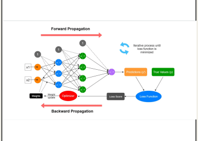

# 02. Neural Networks from Scratch

## 1. Traditional Programming vs Machine Learning

**Traditional Programming** — You write rules manually. Problem: rules can't cover every situation and fail on new data.

**Machine Learning** — Instead of writing rules, the machine *finds the mathematical pattern* automatically from data.

## 2. Simple Example — House Price Prediction

| Size (sq ft) | Price |
| --- | --- |
| 1,000 | $200,000 |
| 1,500 | $300,000 |
| 2,000 | $400,000 |
| 2,500 | **?** |

The pattern here is $200 per sq ft. The goal of ML is to make the machine discover this relationship **on its own**.

## 3. How Machine Learning Works (in one idea)

> **Training = Guess → Measure Error → Correct → Repeat**
> 
1. **Start with a random guess** (random weights)
2. **Measure the error** — how wrong is the prediction?
3. **Adjust** — make the guess slightly better
4. **Repeat millions of times** until error is very small

### 🔴 Forward Propagation (left → right, red arrow going right)

- **x1, x2** = inputs fed into the network
- The **orange nodes** = input neurons
- The **blue nodes** = hidden layer neurons (each does: weighted sum + activation)
- The **"1" grey nodes** = bias nodes (the +b in our formula)
- The **purple node** = output neuron → produces the **Prediction (y')**

---

### 📉 Loss Calculation (right side)

- **Prediction (y')** and **True Value (y)** both go into the **Loss Function**
- Loss Function spits out a **Loss Score** — one number saying how wrong we are
- 🔄 The blue arrows show this process **keeps repeating** until loss is minimized

---

### 🔵 Backward Propagation (right → left, red arrow going left)

- The **Loss Score** goes into the **Optimizer**
- The Optimizer figures out how to adjust each weight
- **Weight Update** happens — all weights shift slightly to reduce future error
- This flows all the way back to the **Weights** box on the left

---

### 🔁 One Full Cycle =

> Input → Predict → Measure Loss → Backpropagate → Update Weights → Repeat
> 

## 4. What is a Neuron?

A neuron is just a **simple math function** — nothing magical.

**Formula:** `output = activation(Σ w·x + b)`

It has 3 parts:

- **Inputs (x)** — the data fed in (e.g. house size, pixel value)
- **Weights (w)** — how *important* each input is
- **Bias (b)** — shifts the result so the neuron is more flexible
- **Activation function** — decides if the signal should "fire" or not

**Think of it like:** each input gets multiplied by its weight, all are added together, then passed through an activation function to get the output.

## 5. Why Activation Functions are Necessary

**The Problem without them:**
If you stack multiple layers without activation functions, all the math collapses into a single equation. 100 layers = same as 1 layer. The network learns nothing extra from being deep.

**The Solution:**
Activation functions add **non-linearity** (bends/curves) to the math so layers don't collapse. This is what allows deep networks to learn complex patterns.

> Key idea: Non-linearity = the secret that makes deep learning possible. A network with non-linear activations can theoretically model *any* function.
> 

## 6. Types of Activation Functions

| Name | Range | When to Use |
| --- | --- | --- |
| **Sigmoid** | 0 to 1 | Probability outputs (classic choice) |
| **Tanh** | -1 to 1 | Faster than sigmoid, zero-centered |
| **ReLU** | 0 to ∞ | Most common — max(0, x). Simple & powerful |
| **GELU / Swish** | Smooth curve | Used in modern LLMs like GPT |

**ReLU is the most popular** — it's just: if input is negative → output 0, else → output the input as-is.

## 7. Loss Function — Measuring How Wrong We Are

**Loss = a single number that says how bad the prediction is**

Lower loss = better model. The whole goal of training is to minimize loss.

**Most common formula — Mean Squared Error (MSE):**

`Loss = (1/n) × Σ(prediction - actual)²`

- Squaring makes all errors positive
- Big errors get penalized more than small ones
- Used for regression (predicting numbers)

**Example:**

- Predicted: $350,000 | Actual: $400,000
- Error = $50,000 → Squared = 2,500,000,000

## 8. Backpropagation — Assigning Blame

After making a wrong prediction, the network asks: *"Which weights caused this mistake?"*

- **Error travels backward** — from output layer → hidden layers → input layer
- Each weight gets adjusted **in proportion to how much it contributed** to the error
- This is done using calculus (chain rule), but the idea is simple: blame the guilty weights more

### 3 Layers in Every Neural Network

- **Input Layer** — receives raw data (x1, x2, x3)
- **Hidden Layer** — processes and learns patterns
- **Output Layer** — gives the final prediction → then loss is calculated

---

### ➡️ Forward Pass (black solid arrows, left to right)

- Data flows **left to right** through all layers
- Each neuron does its calculation and passes result to the next layer
- At the end, we get a prediction and calculate the **Loss**

---

### ⬅️ Backward Pass — error signal (red dotted arrows, right to left)

- The error travels **right to left** back through the network
- It asks each weight: *"how much did YOU contribute to this mistake?"*
- The formula used is **∂Loss/∂w** (just means: how does loss change if we tweak this weight?)
- Each weight gets updated based on its share of the blame

---

### 🧠 Simple way to remember it:

| Pass | Direction | Purpose |
| --- | --- | --- |
| Forward | → left to right | Make a prediction |
| Backward | ← right to left | Fix the mistakes |

## 9. Gradient Descent — How Weights Get Updated

**Analogy:** You're blindfolded on a hilly landscape. Your goal is to reach the lowest valley.

- **Loss Surface** = the landscape (all possible error values)
- **Gradient** = the slope under your feet (tells you which way is downhill)
- **Strategy** = take small steps downhill, repeat until you reach the bottom (minimum loss)

**Learning Rate** controls how big each step is:

- Too **small** → very slow, takes forever
- Too **large** → overshoots, bounces around, never settles
- **Just right** → reaches the minimum efficiently

## 10. The Full Training Loop (Summary)

`① Forward Pass    → data goes in, prediction comes out
② Calculate Loss  → measure how wrong the prediction is
③ Backpropagate   → trace error back to find guilty weights
④ Update Weights  → nudge weights using gradient descent
⑤ Repeat          → do this thousands/millions of times`

## 11. Scale of Real Networks

| Network | Parameters |
| --- | --- |
| Simple XOR Network | ~20 |
| GPT-4 | ~1 Trillion |

Same 4 steps above — just at a *massive* scale!

---

## ✅ Key Takeaways to Remember

1. Neural networks = layers of neurons doing weighted sums
2. Training = keep adjusting weights to reduce loss
3. Backpropagation = traces error backward to find which weights to fix
4. Gradient descent = strategy to step toward lower loss
5. Activation functions = essential for deep networks to actually learn